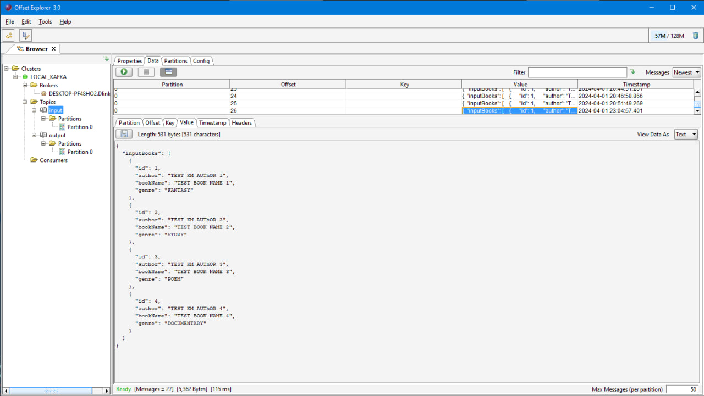
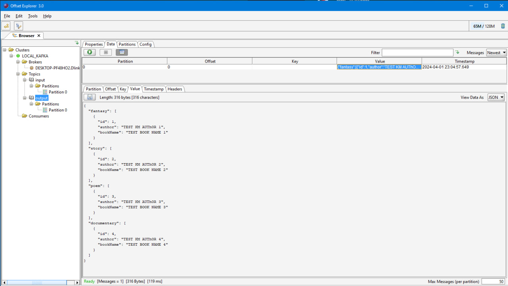

Пример сервиса с spring-kafka
=====================

Сервис принимает на вход сообщение со списком книг и распределяет их по объектам в соответствии с жанром.

Пример входного сообщения:
```json
{
  "inputBooks": [
    {
      "id": 1,
      "author": "TEST KM AUThOR 1",
      "bookName": "TEST BOOK NAME 1",
      "genre": "FANTASY"
    },
    {
      "id": 2,
      "author": "TEST KM AUThOR 2",
      "bookName": "TEST BOOK NAME 2",
      "genre": "STORY"
    },
    {
      "id": 3,
      "author": "TEST KM AUThOR 3",
      "bookName": "TEST BOOK NAME 3",
      "genre": "POEM"
    },
    {
      "id": 4,
      "author": "TEST KM AUThOR 4",
      "bookName": "TEST BOOK NAME 4",
      "genre": "DOCUMENTARY"
    }
  ]
}
```

Пример выходного сообщения:
```json
{
  "fantasy": [
    {
      "id": 1,
      "author": "TEST KM AUThOR 1",
      "bookName": "TEST BOOK NAME 1"
    }
  ],
  "story": [
    {
      "id": 2,
      "author": "TEST KM AUThOR 2",
      "bookName": "TEST BOOK NAME 2"
    }
  ],
  "poem": [
    {
      "id": 3,
      "author": "TEST KM AUThOR 3",
      "bookName": "TEST BOOK NAME 3"
    }
  ],
  "documentary": [
    {
      "id": 4,
      "author": "TEST KM AUThOR 4",
      "bookName": "TEST BOOK NAME 4"
    }
  ]
}
```

Как это выглядит:
-----------------------------------

Сервис просматривает топик input и забирает сообщение со списком книг



Сервис преобразует массив (распределит книги по объектам в зависимости от жанра) и отправит сообщение в топик output

